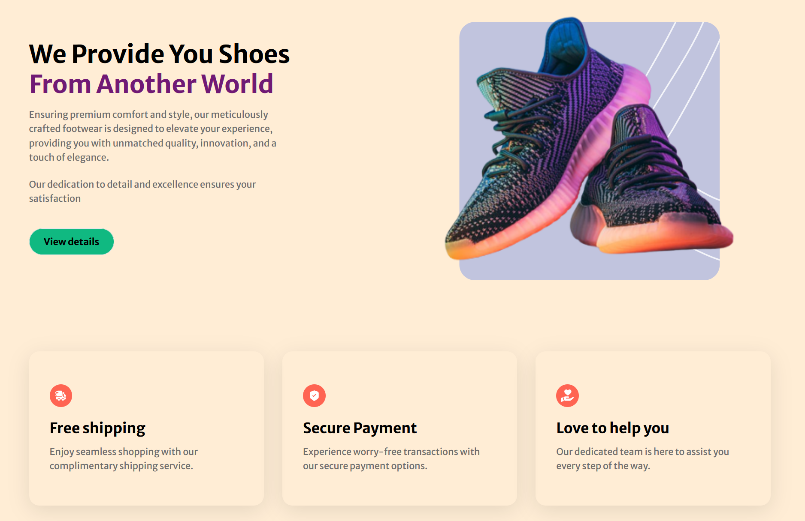

# Buena Vibra - Clothing Website Front-End

Welcome to the front-end repository of Buena Vibra, your one-stop destination for trendy shoes, stylish t-shirts, and cozy hoodies. This repository contains the code responsible for the user interface and overall presentation of our online clothing store.

## Table of Contents

- [Introduction](#introduction)
- [Components and Sections](#components-and-sections)
- [Customization](#customization)
- [Contributing](#contributing)

## Introduction
Buena Vibra is your cool fashion store, offering a curated collection of shoes, t-shirts, and hoodies designed to elevate your style and comfort. Our front-end code ensures a seamless and visually appealing shopping experience for our customers.

## Components and Sections
The following components and sections are included in the front-end code:
    
    Hero: The website's homepage, featuring featured products and a call to action.
    
    PopularProducts: Displaying popular clothing products.
    
    
    SuperQuality: Providing information about the quality of our products.
    Services: Highlighting the services we offer.
    
    
    CustomerReviews: Displaying customer reviews and testimonials.
    
    
    
    Subscribe: Allowing users to sign up for updates and newsletters.
    
    Footer: The website's footer section with links and social media icons.
    These components and sections are modular and can be reused and customized as needed.

## Customization
You can customize various aspects of the website, including:
    Changing the content and images in each section.
    Styling the components using CSS classes and styles.
    Adding or modifying navigation links.
    Integrating with a back-end server for dynamic content.
    Adapt the code to match your brand and requirements.

## Contributing
Feel free to contribute!

